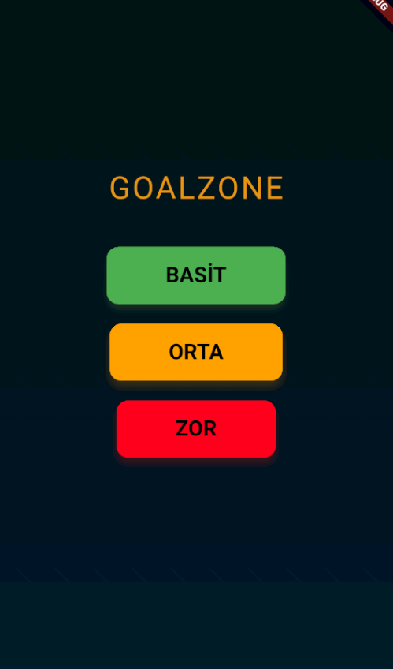
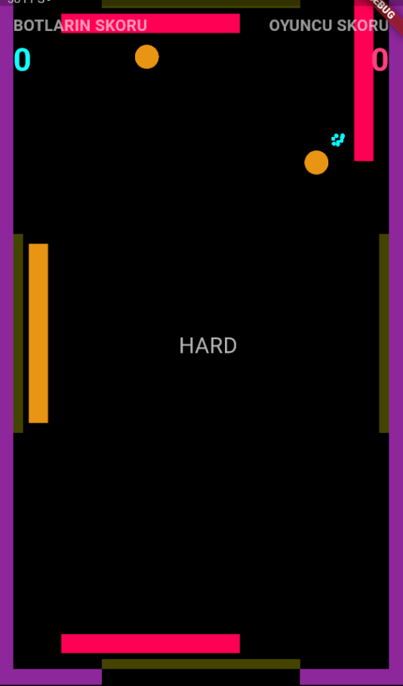

# GoalZone

🚀 Minimalist paddle futbol oyunu — **Flutter & Flame** ile geliştirildi!  
Kolay, Orta ve Zor modlar ile reflekslerini test et, botlara karşı skorunu artır!

---

## 🏆 Özellikler

- ⚡ **Akıcı ve hızlı oyun deneyimi**
- 🎮 **Botlara karşı paddle ile futbol keyfi**
- 🔥 **3 farklı zorluk seviyesi** (Zor modda çift top!)
- 🟢 **Oyuncu vs Bot skorları**
- 🌈 **Modern, sade arayüz**
- 📱 **Android APK dosyası dahil**

---

## 📲 Uygulamayı İndir

- [release/app-release.apk](release/app-release.apk)  
  Android cihazına indir, hemen oyna!

---

## 🖼️ Ekran Görüntüleri

Ana Menü:  


Oyun Ekranı:  


---

## 🚦 Nasıl Oynanır?

- Paddle’ını sürükle, topu savun ve diğer kalelere gol at!
- “Zor” modda iki top var — ekstra heyecan!
- 5 gol atan kazanır.

---

## 🔧 Kurulum (Geliştiriciler için)

```sh
git clone https://github.com/Ahmetmelihdenizz/goalzone.git
cd goalzone
flutter pub get
flutter run
